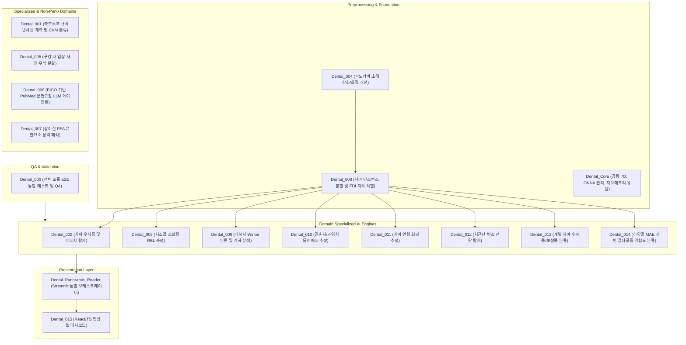

# [260903 1645 메인 워크스테이션 프로젝트 파악 및 코드 리뷰]

Ran command: `Get-ChildItem -Path "Y:\" -Directory -Filter "Dental_*" | Select-Object Name`
Ran command: `Get-ChildItem -Path "Y:\" -Directory -Filter "Dental_*" | ForEach-Object {
    $dir = $_.FullName
    $readme = Join-Path $dir "README.md"
    Write-Output "==================== [$($_.Name)] ===================="
    if (Test-Path $readme) {
        Get-Content $readme -TotalCount 25 | Out-String
    } else {
        Write-Output "NO README.md found"
    }
}`
Ran command: `[Console]::OutputEncoding = [System.Text.Encoding]::UTF8
Get-ChildItem -Path "Y:\" -Directory -Filter "Dental_*" | ForEach-Object {
    $dir = $_.FullName
    $readme = Join-Path $dir "README.md"
    Write-Host "==================== [$($_.Name)] ===================="
    if (Test-Path $readme) {
        Get-Content $readme -Encoding UTF8 -TotalCount 25 | Out-String | Write-Host
    } else {
        Write-Host "NO README.md found"
    }
}`
Ran command: `[Console]::OutputEncoding = [System.Text.Encoding]::UTF8
0..6 | ForEach-Object {
    $idx = "{0:D3}" -f $_
    $name = "Dental_$idx"
    $readme = "Y:\$name\README.md"
    Write-Host "==================== [$name] ===================="
    if (Test-Path $readme) {
        Get-Content $readme -Encoding UTF8 -TotalCount 20 | Out-String | Write-Host
    } else {
        Write-Host "NO README"
    }
}`
Ran command: `[Console]::OutputEncoding = [System.Text.Encoding]::UTF8
$r000 = Get-Content "Y:\Dental_000\README.md" -Encoding UTF8 -TotalCount 20 | Out-String
Write-Host "=== Dental_000 ==="
Write-Host $r000

7..12 | ForEach-Object {
    $idx = "{0:D3}" -f $_
    $name = "Dental_$idx"
    $readme = "Y:\$name\README.md"
    Write-Host "==================== [$name] ===================="
    if (Test-Path $readme) {
        Get-Content $readme -Encoding UTF8 -TotalCount 20 | Out-String | Write-Host
    } else {
        Write-Host "NO README"
    }
}`
Ran command: `[Console]::OutputEncoding = [System.Text.Encoding]::UTF8
Get-Content "Y:\Dental_000\README.md" -Encoding UTF8 -TotalCount 35 | Out-String | Write-Host`
Listed directory Dental_Core
Listed directory dental_core
Ran command: `Get-ChildItem -Path "Y:\Dental_Core\dental_core" -Recurse -File | Select-Object FullName`
Listed directory Dental_Panoramic_Reader
Listed directory modules

Dental 시리즈 총 18개 레포지토리의 아키텍처, 데이터 파이프라인, 모듈 간 상호의존성 및 기술적 병목 사항에 대한 종합 분석 보고입니다. 

문서 및 코드의 생성이나 수정 없이 순수 읽기 권한을 기반으로 코드베이스와 형상 관리 상태를 전수 조사하였습니다.

---

# 1. 전체 프로젝트 조망 및 시스템 구조

Dental 프로젝트군은 파노라마 방사선 영상 및 치과 임상 데이터를 바탕으로 화질 개선, 해부학적 구조 분할, 질환 탐지, 역학 해석, 진단 리포팅까지 수행하는 모듈형 임상 인공지능 플랫폼 생태계입니다.

전체 시스템은 다음과 같은 5대 계층(Tier)으로 수직 분화되어 있습니다.

---

# 2. 레포지토리별 세부 역할 및 핵심 기술 스택

[기반 인프라 및 전처리]
- Dental_Core: 
  - 역할: 전 모듈 공통 유틸리티 라이브러리 (`dental_core`).
  - 기술: PyTorch-to-ONNX 변환기, HuggingFace 연동 ONNX 매니저, DICOM/이미지 파서, 폴리곤 기하 연산 모듈.
- Dental_004 (Pano_clear):
  - 역할: 저품질 파노라마 영상의 잡음 제거 및 초해상화(Super-Resolution) 복원.
  - 기술: Deep Learning 기반 영상 복원 파이프라인. 전체 진단 파이프라인의 진입부 전처리 담당.
- Dental_008 (Dentex Segmentation):
  - 역할: 파노라마 내 유치 및 영구치(치배 포함) 인스턴스 분할 및 FDI 치식(11~48) 번호 부여.
  - 기술: 혼합치열기 판별 이진 분류기 + YOLOv8-seg. 하류(Downstream) 질환 분석 모듈들의 기준 좌표계(Anchor) 역할.

[파노라마 질환 및 임상 분석 모듈]
- Dental_002: 치아 자체 우식증(충치) 및 매복치 검출 (YOLOv8 + SAHI 고해상도 분할 추론).
- Dental_003: 치주염에 따른 치조골 소실량(RBL) 측정 (YOLOv8 + SAM 제로샷 마스킹 기반 CEJ, Crest, Apex 계측).
- Dental_009: 매복치(주로 제3대구치) 난이도 상세 분석 (Dental_008 마스크 기반 PCA 장축 추정 및 Winter's Classification, 맹출 상태 룰 판별).
- Dental_010: 결손치 및 과잉치 식별 (Dental_008 FDI 치식 집합과 정상 32개 영구치 치식 간 차집합 연산 룰 모듈).
- Dental_011: 치아 연령 추정 (파노라마 영상 기반 ResNet18 회귀 모델).
- Dental_012: 치근단 병소(Periapical Lesion) 전담 탐지 (YOLOv11s 기반, Dental_002에서 분리된 치조골 내부 병변 집중 분석).
- Dental_013: 치아 수복물/보철물 상태 분류 (Dental_008에서 크롭된 치아 단위 이미지 대상 Crown, Implant, Filling, RCT 다중 클래스 분류).
- Dental_014: 하악골 텍스처 분석을 통한 골다공증 위험도 스크리닝 (Masked Autoencoder 기반 ViT 백본 `OsteoMAENet`, 해부학적 Spatial Attention, Ordinal Loss + SupCon 복합 손실 함수 적용).

[특수 도메인 및 비파노라마 모듈]
- Dental_001: 측모두부 규격 방사선 사진(Lateral Ceph) 랜드마크 탐지 및 경추 성숙도(CVM) 단계 분류.
- Dental_005: 실제 구강 내 임상 사진(Intraoral Photo) 대상 치아 우식증 인스턴스 분할 (AlphaDent).
- Dental_006: PICO 질의 기반 PubMed 논문 수집 및 Gemma LLM 기반 문헌 선별/근거 요약 (SR-Gemma4).
- Dental_007: 상아질 STL 지오메트리 메싱(Gmsh) 및 FEniCSx(dolfinx) 기반 정적 선형 탄성 유한요소해석(FEA), 응력 분포 GLB 3D 시각화.

[통합 서빙, UI 및 검증]
- Dental_Panoramic_Reader: 
  - 역할: 단일 파노라마 영상을 입력받아 서브모듈(002, 003, 004, 008, 009, 010, 011, 012, 013, 014)을 순차/병렬 구동하고 통합 진단 리포트를 생성하는 오케스트레이터.
  - 기술: Streamlit, 동적 메모리 언로드(Dynamic VRAM Unloading, 피크 VRAM ~6.5GB 유지).
- Dental_015: 임상 프로덕션 타깃 전용 웹 프론트엔드 플랫폼 (React 18, TypeScript, Vite, TailwindCSS, MSA API 클라이언트 레이어).
- Dental_000: 전체 서브모듈(001~014) E2E 벤치마크 평가 및 단위 테스트, HiTL 라벨 교정 도구가 집약된 중앙 QA 저장소.

---

# 3. 비판적 분석 및 엔지니어링 병목 사항

전체 시스템을 코드 레벨에서 조망했을 때 발견되는 구조적 한계와 잠재적 결함 요인은 다음과 같습니다.

1. Dental_008에 대한 극단적인 단일 장애점(SPOF) 종속성
- Dental_009(매복치 각도), Dental_010(결손치 룰베이스), Dental_012(병변-치아 매핑), Dental_013(개별 치아 보철 분류)이 모두 Dental_008의 인스턴스 분할 및 FDI 치식 부여 결과에 직결되어 있습니다.
- 소구치 교정 발치 환자나 선천적 결손 환자에서 발생하는 [치식 밀림(drift)] 현상이 008에서 발생할 경우, 하류의 009, 010, 013 결과 전체가 연쇄적으로 왜곡되는 취약한 파이프라인 구조를 가집니다.

2. 런타임 환경 파편화 (Windows vs Linux)
- 대부분의 모듈(YOLO, PyTorch, Streamlit)은 Windows 환경(CUDA 12.x, RTX 5080)에서 네이티브 실행되나, 물리 해석 모듈인 Dental_007은 `dolfinx(FEniCSx)` 및 `mpi4py` 의존성으로 인해 Windows 네이티브 구동이 불가하며 WSL2/Linux 컨테이너를 강제합니다. 
- 파이프라인 통합 시 환경 브릿지(WSL/Docker API) 부재 시 파이프라인 단절 위험이 존재합니다.

3. 서빙 계층의 전환 과도기
- 현재 실제 동작 가능한 E2E 오케스트레이션 엔진은 Python/Streamlit 기반의 `Dental_Panoramic_Reader`에 머물러 있습니다.
- 웹 플랫폼인 `Dental_015(React/Vite)`가 신규 착수되었으나, 각 모듈들을 마이크로서비스로 중계할 백엔드 API 게이트웨이(FastAPI/gRPC 등)와의 실제 결합 명세가 완전히 동기화되지 않은 상태입니다.

4. 일부 모듈의 릴리스 보류 상태
- Dental_010(결손치/과잉치)의 경우 오픈 데이터셋의 정답 라벨 한계로 인해 자체 정량 검증이 불가능하여 릴리스 보류 상태이며, Dental_000의 지표 집계에서도 정밀도 12%~36% 수준의 클래스 불균형 문제를 해소하기 위한 후처리 필터 튜닝이 계속 요구되는 단계입니다.

전체 프로젝트는 개별 모듈 단위의 알고리즘(YOLO, SAM, MAE, FEniCS, LLM) 연구 단계를 지나, 오케스트레이터(Dental_Panoramic_Reader)와 프론트엔드(Dental_015) 중심의 상용 통합 단계로 진입하고 있는 구성입니다.