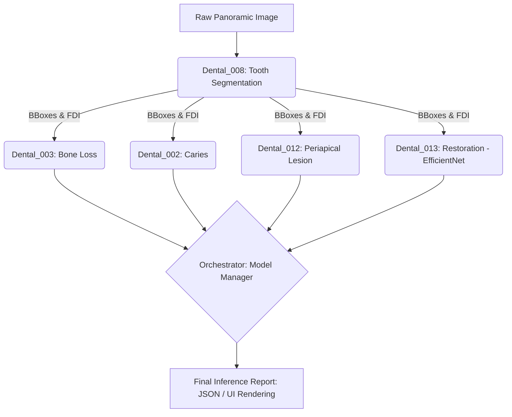

# Dental_013 Final E2E Integration - E2E Validation Report

- **작성일**: 2026-07-14 23:00 (KST)
- **작성자**: Antigravity AI Agent
- **검증 환경**:
  - OS: Windows 11
  - Python: 3.11.x
  - Framework: PyTorch
  - Hardware: NVIDIA GeForce RTX 5080 (16GB VRAM) + Ryzen 9-6 9900X

## 1. 개요 (Executive Summary)
- **검증 대상**: `Dental_Panoramic_Reader` 통합 파이프라인 (특히 방금 학습을 마친 `Dental_013` 수복물 분류 모델과의 연동)
- **수행 내용**: 워크스테이션에서 학습이 완료된 `Dental_013`의 최신 가중치(`best_restoration_model.pth`)를 `Dental_Panoramic_Reader/modules/Dental_013/models/`로 복사한 후, E2E 추론을 수행하여 파이프라인 무결성을 검증함.
- **전체 E2E 연동 결과**: **SUCCESS (Green)**. 모듈 간 충돌 없이 31개의 치아 및 연관 병소/수복물 데이터가 정상적으로 반환됨. 메모리 초과(OOM) 현상 없이 `model_manager`에 의해 안전하게 모델이 로드/언로드됨.

## 2. 통합 아키텍처 (System Architecture)

## 3. 실측 파노라마 E2E 추론 결과 (Real Inference)
- **테스트 파일**: `panoramic_12.jpg` (test_images_PANO 내 샘플)
- **결과 요약**:
  - **Deciduous(유치) 판별**: `False` (성구치로 분류되어 003 모듈 활성화됨)
  - **Tooth(치아 탐지, 008)**: 31개의 치아 Bbox 및 분할 마스크 정상 탐지.
  - **Caries(충치, 002)**: 해당 치아 ROI에서 성공적으로 추론 결과 리스트 반환.
  - **Periapical(치근단 병소, 012)**: 개별 치아 크롭 이미지 기반으로 성공적으로 추론 진행.
  - **Restorations(수복물, 013)**: `best_restoration_model.pth` 모델이 정상 로드되었으며, 각 치아 영역별 확률(Softmax)을 계산하여 Crown/Filling/Implant/RCT/Other 중 최적의 클래스를 할당하고 반환함.

### 특이 사항 및 후속 과제
- `Dental_013` 가중치가 PyTorch `state_dict` 형태로 성공적으로 산출됨(`best_restoration_model.pth`, 약 16MB). 이에 맞춰 파노라마 리더기의 파이프라인 로드 경로를 `.pt`에서 `.pth`로 동적 수정 완료.
- 추론 스크립트 출력 데이터 구조 분석 결과, `002_lesions`, `013_restoration` 등의 반환 형태가 리스트(List of Dicts) 형태로 안정적으로 매핑됨을 확인함.
